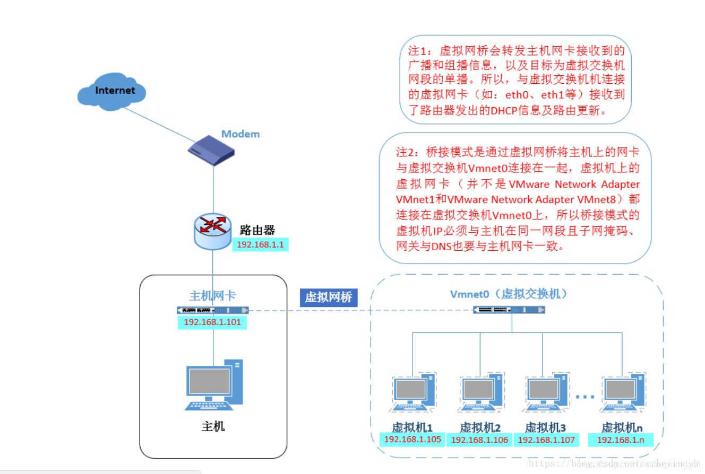
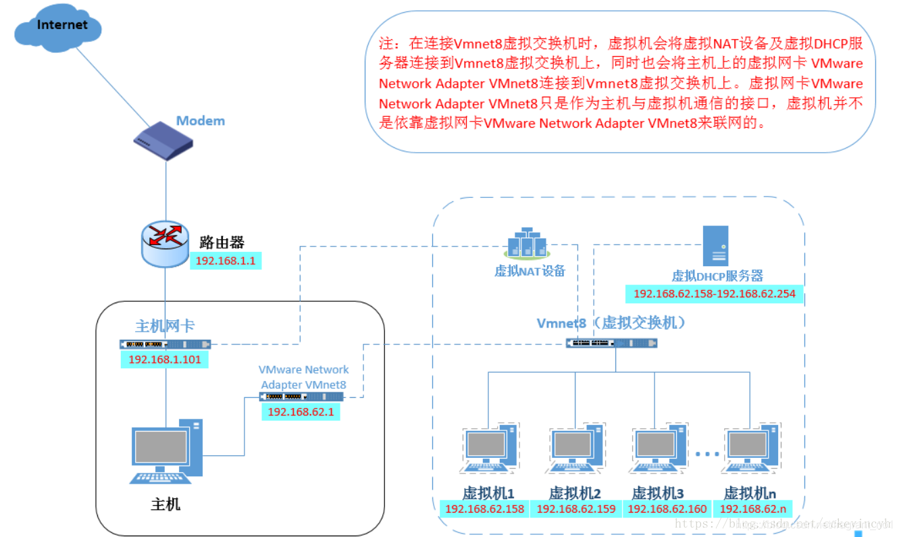
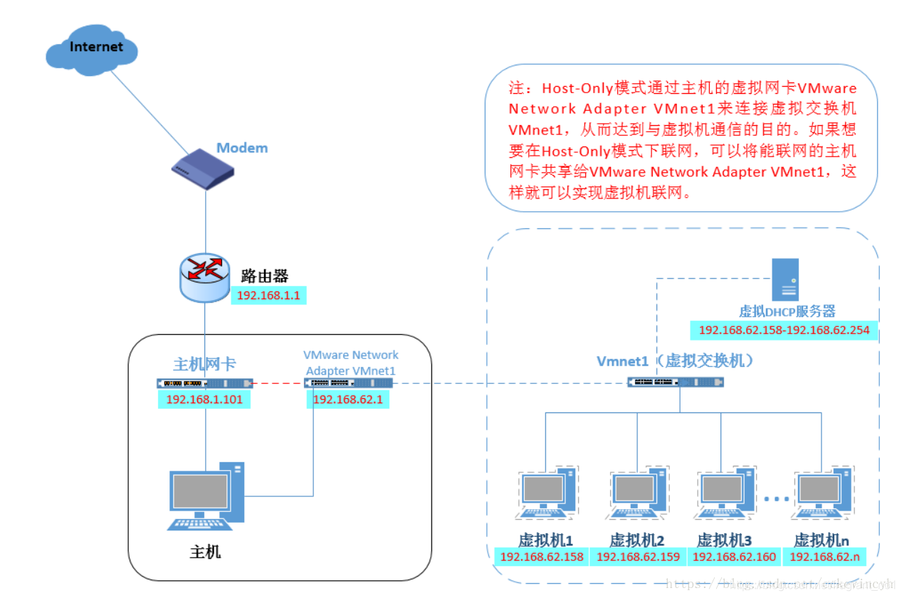

## VMware中的三种网络连接方式

### 1.bridged(桥接模式)

- VMnet0虚拟交换机，虚拟机就像是局域网中的一台独立的主机，与宿主计算机一样，它可以访问网内任何一台机器。

在桥接模式下，可以手工配置它的TCP/IP配置信息（IP、子网掩码等，而且还要和宿主机器处于同一网段），以实现通过局域网的网关或路由器访问互联网；还可以将IP地址和DNS设置成“自动获取”。

### 2.NAT(网络地址转换模式)

- 使用NAT模式，就是让虚拟机借助NAT（网络地址转换）功能，通过宿主机器所在的网络来访问公网。也就是说，使用NAT模式可以实现在虚拟系统里访问互联网。

- NAT模式下的虚拟机的TCP/IP配置信息是由VMnet8虚拟网络的DHCP服务器提供的，因此IP和DNS一般设置为“自动获取”，因此虚拟系统也就无法和本局域网中的其他真实主机进行通讯。

采用NAT模式最大的优势是虚拟系统接入互联网非常简单，不需要进行任何其他的配置，只需要宿主机器能访问互联网即可。如果你想利用VMWare安装一个新的虚拟系统，在虚拟系统中不用进行任何手工配置就能直接访问互联网，建议你采用NAT模式。

### 3.host-only(主机模式)

- 在host-only模式中，虚拟机只能与虚拟机、主机互访，但虚拟机和外部的网络是被隔离开的，也就是不能上网。
- 在host-only模式下，虚拟系统的TCP/IP配置信息（如IP地址、网关地址、DNS服务器等），都是由VMnet1虚拟网络的DHCP服务器来动态分配的。

`VMnet0`：用于虚拟桥接网络下的虚拟交换机

`VMnet1`：用于虚拟Host-Only网络下的虚拟交换机

`VMnet8`：用于虚拟NAT网络下的虚拟交换机

`VMware Network Adepter VMnet1`：Host用于与Host-Only虚拟网络进行通信的虚拟网卡

`VMware Network Adepter VMnet8`：Host用于与NAT虚拟网络进行通信的虚拟网卡

`VMnet8`和`VMnet1`提供DHCP服务，`VMnet0`虚拟网络则不提供。