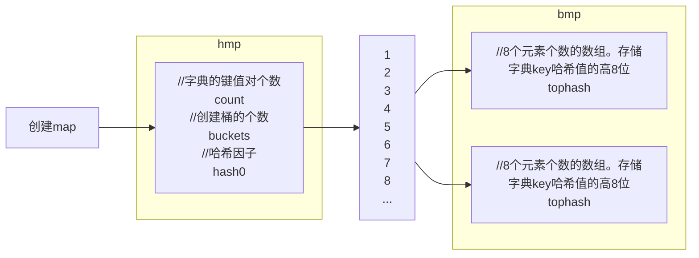
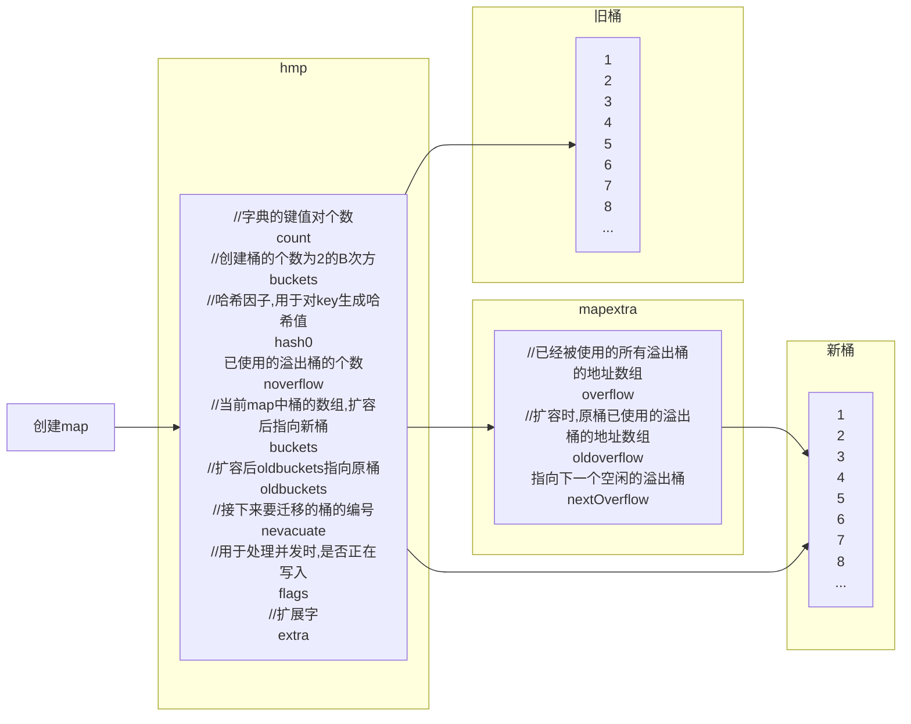

**map就是一个哈希表**



### 1.初始化

```go
 info := make(map[string]string, 10)
```

- 1.创建一个hmap结构体对象

- 2.生成一个哈希因子hash0并赋值到hmap对象中(用于后续为key创建哈希值)

- 3.根据hint=0，并根据算法规则来创建B，当前B应该为1

  ```
  hint			B
  0-8				0
  9-13			1
  14-26			2
  ...
  ```

- 4.根据B去创建新桶，并存放在buckets数组中，当前bmap的数量应为2

  - 当B<4时，根据B创建桶的个数的规则为：`2^B`
  - 当B>=4时，根据B创建桶的个数规则为`2^B+2^B-4`（标准桶+溢出桶）

  注意：每个bmap中可以存储8个键值对，当不够存储时就需要使用溢出桶。

### 2.写入数据

```go
info["name"] = "James"
```

- 1.结合哈希引子和键`name`生成哈希值`010001111010101110110`

- 2.获取哈希值的后8位，并根据后B位的值决定将此键值对存放到哪个桶中(bmap)

  ```
  将哈希值和桶掩码进行&运算，最终得到哈希值的后B位值，假设当B为1时，其结果为0：
  哈希值 010001111010101110110
  桶掩码 000000000000000000001
  结果   000000000000000000000 = 0
  根据后B位的位运算计算出索引位置，然后再去buckets数组中根据索引找到目标桶(bmap)
  ```

- 3.在上一步确定桶之后，接下来就在桶中写入数据

  ```
  获取哈希值的tophash(哈希值的'高8位'),将tophash、key、value分别写入到桶中的三个数组中
  如果桶已满，则通过overflow找到溢出桶，并在溢出桶中继续写入
  以后在桶中查找数据时，会根据tophash来进行查找
  ```

- 4.hmap的个数count++(map中的元素个数+1)

### 3.读取数据

```go
value := info["name"]
```

- 1.结合哈希引子和键`name`生成哈希值

- 2.获取哈希值的后B位，根据后B位的值决定去哪个桶中找这个键值

- 3.确定桶之后，确定key的哈希值的tophash(高8位)，根据tophash和key去桶中查找

  当前桶如果没有找到，则根据overflow再去溢出桶中找，均未找到则表示key不存在。

### 4.扩容

**翻倍扩容**

**等量扩容**

- 1.B会根据扩容后新桶的个数进行增加(翻倍扩容B=旧B+1,等量扩容B=旧B)
- 2.`oldbuckets`指向原来的桶(旧桶)
- 3.`buckets`指向新建的桶(新桶中暂时没有数据)
- 4.`nevacuate`设置为0，表示如果数据迁移的话，应该从原桶(旧桶)中的第0个位置开始迁移
- 5.`noverflow`设置为0，扩容后新桶中已使用的溢出桶为0
- 6.`extra.oldoverflow`设置为原桶中已使用的所有溢出桶，`h.extra.oldoverflow = h.extra.overflow`
- 7.`extra.overflow`设置为nil，因为新桶中还未使用溢出桶
- 8.`extra.nextOverflow`设置为新创建的新桶中的第一个溢出桶位置


### 5.数据迁移

**翻倍扩容**

后B位+1

**等量扩容**





