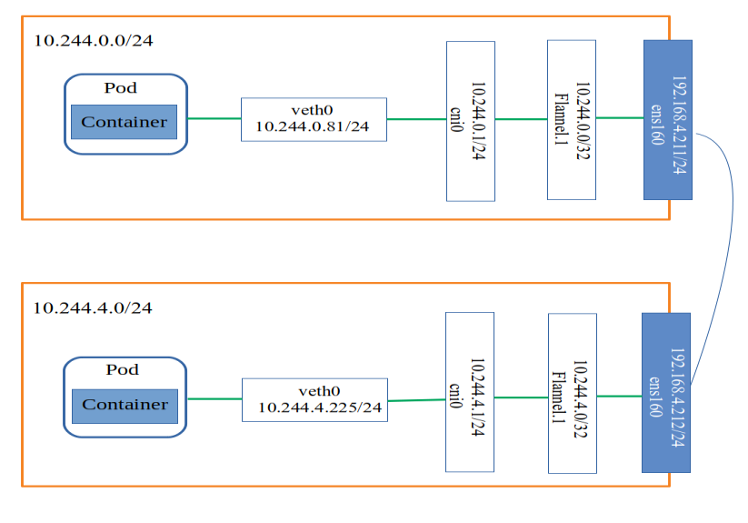

## flannel工作原理

  Flannel是kubernetes的CNI网络插件之一，**实质上是一种主机 overlay网络**。flannel支持多种网络转发模式，常用的是**vxlan、hostgw**等。

### 一、特点

  1.使集群中的不同Node主机创建的Docker容器都具有全集群唯一的虚拟IP地址

  2.建立一个覆盖网络(overlay network)，通过这个覆盖网络，将数据原封不动的传递到目标容器。覆盖网络是建立另一个网络之上并由基础设施支持的虚拟网络。

  3.创建一个新的虚拟网卡flannel0接收docker网桥的数据，通过维护路由表，对接收到的数据进行封包和转发。

  4.etcd保证了所有node上flanned所看到的配置是一致的。同时每个node上的flanned监听etcd上的数据变化，实时感知集群中node的变化。

  
### 二、组件

  1.Cni0：网桥设备，每创建一个Pod都会创建一对veth pair。其中一端是Pod中的veth0,另一端是Cni0网桥中的端口(网卡)。Pod从网卡veth0发出的流量都会发送到Cni0网桥设备的端口(网卡)上。**Cni0设备获得的ip地址是该节点分配到的网段的第一个地址**

  2.Flannel.1:overlay网络的设备，**用来进行vxlan报文的处理(封包和解包)**。不同的node之间的Pod数据流量都从overlay设备以隧道的形式发送到对端

  3.Flanneld:flannel在每个主机中运行flanneld作为agent,它会为所在主机从集群的网络地址空间中，获取一个小的网段subnet，本主机内所有容器的IP地址都将从中分配。同时Flanneld监听K8s集群数据库，为flannel.1设备提供封装数据时必要的mac，ip等网络数据信息。

### 三、不同node上的Pod的通信流程

  1. pod中产生数据，根据pod的路由信息，将数据发送到Cni0
  2. Cni0 根据**节点的路由表**，将数据发送到隧道设备flannel.1
  3. Flannel.1查看数据包的目的ip，从flanneld获得对端隧道设备的必要信息，封装数据包。
  4. Flannel.1将数据包发送到对端设备。对端节点的网卡接收到数据包，发现数据包为overlay数据包，解开外层封装，并发送内层封装到flannel.1设备。
  5. Flannel.1设备查看数据包，根据路由表匹配，将数据发送给Cni0设备。
  6. Cni0匹配路由表，发送数据给网桥上对应的端口。

  

### 四、例子

  |           |      master      |           node            |
  | :-------: | :--------------: | :-----------------------: |
  |  ens160   | 192.168.4.211/24 |     192.168.4.212/24      |
  | flannel.1 |  10.244.0.0/32   |       10.244.4.0/32       |
  |   cni0    |  10.244.0.1/24   |       10.244.4.1/24       |
  |   PodIP   |   10.244.0.81    | 10.244.4.225/10.244.4.226 |

  **通过master节点的容器`10.244.0.81`来ping node节点的容器`10.244.4.224`**

  - 1.查看容器`10.244.0.81`在master节点上的veth卡

  ```
  -bash-4.2# ip a s
  2: ens160: <BROADCAST,MULTICAST,UP,LOWER_UP> mtu 1500 qdisc mq state UP group default qlen 1000
      link/ether 00:50:56:81:20:9e brd ff:ff:ff:ff:ff:ff
      inet 192.168.4.211/24 brd 192.168.4.255 scope global noprefixroute ens160
         valid_lft forever preferred_lft forever
      inet6 fe80::250:56ff:fe81:209e/64 scope link 
         valid_lft forever preferred_lft forever
  4: flannel.1: <BROADCAST,MULTICAST,UP,LOWER_UP> mtu 1450 qdisc noqueue state UNKNOWN group default 
      link/ether 12:78:a9:fc:ba:46 brd ff:ff:ff:ff:ff:ff
      inet 10.244.0.0/32 scope global flannel.1
         valid_lft forever preferred_lft forever
      inet6 fe80::1078:a9ff:fefc:ba46/64 scope link 
         valid_lft forever preferred_lft forever
  9: cni0: <BROADCAST,MULTICAST,UP,LOWER_UP> mtu 1450 qdisc noqueue state UP group default qlen 1000
      link/ether 1e:53:39:d7:78:58 brd ff:ff:ff:ff:ff:ff
      inet 10.244.0.1/24 brd 10.244.0.255 scope global cni0
         valid_lft forever preferred_lft forever
      inet6 fe80::1c53:39ff:fed7:7858/64 scope link 
         valid_lft forever preferred_lft forever
  16: veth65c761b0@if3: <BROADCAST,MULTICAST,UP,LOWER_UP> mtu 1450 qdisc noqueue master cni0 state UP group default 
      link/ether 9e:ab:70:12:6b:04 brd ff:ff:ff:ff:ff:ff link-netnsid 1
      inet6 fe80::9cab:70ff:fe12:6b04/64 scope link 
  ```

  - 2.这个veth的网卡会桥接在cni0的网桥上，通过`brctl show`进行查看

  ```
  -bash-4.2# brctl show
  bridge name	bridge id		STP enabled	interfaces
  cni0		8000.1e5339d77858	no		veth65c761b0
  ```

  - 3.数据包走到了cni0的网桥后，根据已经的目标ip,·`10.244.4.225`，可以查找路由表，根据路由和掩码，选择对应的iface，也就是flannel.1。且下一跳，也就是10.244.4.0。

  ```
  -bash-4.2# route -n
  Kernel IP routing table
  Destination     Gateway         Genmask         Flags Metric Ref    Use Iface
  0.0.0.0         192.168.4.1     0.0.0.0         UG    100    0        0 ens160
  10.244.0.0      0.0.0.0         255.255.255.0   U     0      0        0 cni0
  10.244.2.0      10.244.2.0      255.255.255.0   UG    0      0        0 flannel.1
  *10.244.4.0      10.244.4.0      255.255.255.0   UG    0      0        0 flannel.1
  172.17.0.0      0.0.0.0         255.255.0.0     U     0      0        0 docker0
  192.168.4.0     0.0.0.0         255.255.255.0   U     100    0        0 ens160
  ```

  - 4.进入到flannel.1后，通过arp来查看对应的mac地址，获取需要发向哪个物理机。

  ```
  -bash-4.2# arp -e
  Address                  HWtype  HWaddress           Flags Mask            Iface
  192.168.4.181            ether   6c:92:bf:44:77:de   C                     ens160
  *10.244.4.0               ether   5a:9b:c3:d3:55:af   CM                    flannel.1
  k8s-node1                ether   00:50:56:81:7d:d1   C                     ens160
  ```

  - 5.这个mac地址在vxlan中，可以通过`bridge fdb show`来进行查看。可以看到，如果是发向`5a:9b:c3:d3:55:af`的地址，则目标机器在192.168.4.212机器上。数据就会流转到192.168.4.212上了。经过vxlan封包后的数据包就会经过ens160设备发向到192.168.4.212上。

  ```
  -bash-4.2# bridge fdb show
  5a:9b:c3:d3:55:af dev flannel.1 dst 192.168.4.212 self permanent
  ```

  - 6.在192.168.4.212上，首先经过了iptables链，而后在flannel.1的Iface上接收到该数据包。这里我们可以看到，flannel.1的mac地址就是`5a:9b:c3:d3:55:af`

  ```
  -bash-4.2# ip  a s
  2: ens160: <BROADCAST,MULTICAST,UP,LOWER_UP> mtu 1500 qdisc mq state UP group default qlen 1000
      link/ether 00:50:56:81:7d:d1 brd ff:ff:ff:ff:ff:ff
      inet 192.168.4.212/24 brd 192.168.4.255 scope global noprefixroute ens160
         valid_lft forever preferred_lft forever
      inet6 fe80::250:56ff:fe81:7dd1/64 scope link 
         valid_lft forever preferred_lft forever
  5: flannel.1: <BROADCAST,MULTICAST,UP,LOWER_UP> mtu 1450 qdisc noqueue state UNKNOWN group default 
      link/ether 5a:9b:c3:d3:55:af brd ff:ff:ff:ff:ff:ff
      inet 10.244.4.0/32 scope global flannel.1
         valid_lft forever preferred_lft forever
      inet6 fe80::589b:c3ff:fed3:55af/64 scope link 
         valid_lft forever preferred_lft forever
  6: cni0: <BROADCAST,MULTICAST,UP,LOWER_UP> mtu 1450 qdisc noqueue state UP group default qlen 1000
      link/ether da:48:d7:27:65:4c brd ff:ff:ff:ff:ff:ff
      inet 10.244.4.1/24 brd 10.244.4.255 scope global cni0
         valid_lft forever preferred_lft forever
      inet6 fe80::d848:d7ff:fe27:654c/64 scope link 
         valid_lft forever preferred_lft forever
  18: veth00a59f58@if3: <BROADCAST,MULTICAST,UP,LOWER_UP> mtu 1450 qdisc noqueue master cni0 state UP group default 
      link/ether 32:4d:61:6e:0f:5c brd ff:ff:ff:ff:ff:ff link-netnsid 1
      inet6 fe80::304d:61ff:fe6e:f5c/64 scope link 
         valid_lft forever preferred_lft forever
  ```

  - 7.到达flannel.1后，根据路由表，查看10.244.4.255的路由应送到192.168.4.212的cni0的网桥上

  ```
  -bash-4.2# route -n
  Kernel IP routing table
  Destination     Gateway         Genmask         Flags Metric Ref    Use Iface
  0.0.0.0         192.168.4.1     0.0.0.0         UG    100    0        0 ens160
  10.244.0.0      10.244.0.0      255.255.255.0   UG    0      0        0 flannel.1
  10.244.2.0      10.244.2.0      255.255.255.0   UG    0      0        0 flannel.1
  *10.244.4.0      0.0.0.0         255.255.255.0   U     0      0        0 cni0
  172.17.0.0      0.0.0.0         255.255.0.0     U     0      0        0 docker0
  172.20.0.0      0.0.0.0         255.255.0.0     U     0      0        0 br-3eee38141cfa
  192.168.4.0     0.0.0.0         255.255.255.0   U     100    0        0 ens160
  ```

  - 8.查看cni0的网桥信息

  ```
  -bash-4.2# brctl show
  bridge name	bridge id		STP enabled	interfaces
  br-3eee38141cfa		8000.024247be5242	no		
  cni0		8000.da48d727654c	no		*veth00a59f58
  										veth3626b4cf
  										veth9b60d391
  										
  -bash-4.2# docker exec -it 89300193f5f2 sh
  / # ip a s
  1: lo: <LOOPBACK,UP,LOWER_UP> mtu 65536 qdisc noqueue qlen 1000
      link/loopback 00:00:00:00:00:00 brd 00:00:00:00:00:00
      inet 127.0.0.1/8 scope host lo
         valid_lft forever preferred_lft forever
  3: eth0@if18: <BROADCAST,MULTICAST,UP,LOWER_UP,M-DOWN> mtu 1450 qdisc noqueue 
      link/ether 56:64:52:46:d5:6f brd ff:ff:ff:ff:ff:ff
      inet 10.244.4.225/24 brd 10.244.4.255 scope global eth0
         valid_lft forever preferred_lft forever
  ```

  到达cni0网桥后，就可以根据地址将数据送到10.244.4.225的对应的veth上，进而在容器中收到对应的数据包了。

### 五、综上：

- 1.不同物理机容器间发送数据包的流程，`veth -> cni0 -> flannl.1 -> ens160 -> 目标机器的ens160 -> 目标机器flannel.1 -> 目标机器的cni0 -> 目标容器veth`

- 2.容器到物理机间发送数据包的流程，`veth -> cni0 -> ens160 -> 目标物理机ip`

- 3.同一物理机上容器间发送数据包的流程，`veth -> cni0 -> 目标容易veth`

