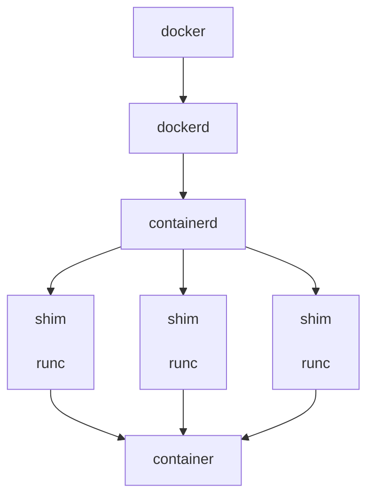
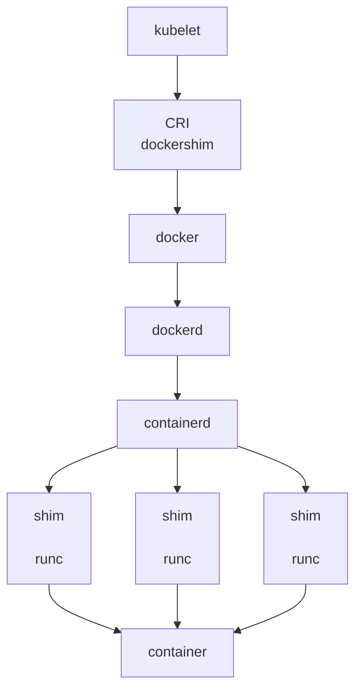
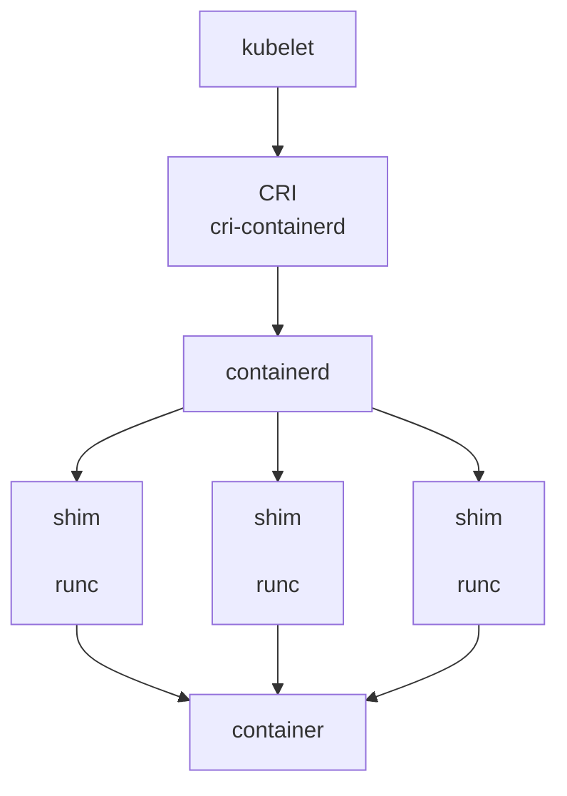

## k8s弃用docker

### 1.docker创建的流程

- **docker**:命令行工具；

- **dockerd**：docker守护进程，负责与docker client交互；

- **containerd**：负责镜像管理与容器管理的守护进程。

  containerd是一个标准的容器运行时，可以独立管理容器的生命周期，也就是即使不运行dockerd，容器也能正常工作。

- **containerd-shim**:是一个真实运行的容器的载体，每启动一个容器都会起一个新的shim进程；

- **runC**:一个命令行工具，根据OCI标准来创建和运行容器。

每次执行`docker run`创建一个容器时，大致流程如下：

1.docker工具向dockerd守护进程发送创建容器的请求；

2.dockerd收到请求后再向containerd请求创建一个容器；

3.containerd收到请求后并不会直接创建容器，而让shim创建容器；

4.docker-shim又调用runC创建容器(准备容器所需的namespace和cgroups就退出了)，docker-shim就作为了该容器进程的父进程，负责收集容器状态并上报给containerd。

### 2.k8s使用docker的创建流程

**从图中可以看出调用链复杂，多层封装和调用，导致性能降低、提升故障率、不易排查**

### 3.k8s把container runtime换成containerd

**调用链更短，组件更少，占用节点的资源更少**

综上所述，弃用的主要原因：

**1.Docker是一个完整的技术堆栈，它的一部分叫做containerd，本身就是一个高级容器运行时。有很多UX增强功能，但是这些功能对于k8s来说是没有必要的；**

**2.针对对人类友好的抽象层，k8s必须使用一个dockershim来获取其真正需要的内容，需要加以维护并且可能会损坏，从而成为一种负担；**

**3.`docker build`产生的镜像并不是Docker特有的，而是OCI (Open Container Initiative)镜像。任何与OCI兼容的镜像，无论用于构建他们的工具如何，对于k8s看起来都是相同的**